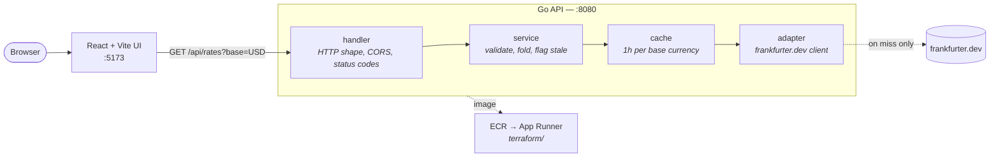

# Currency Watcher

Currency rate dashboard: a Go API that serves exchange rates from
[frankfurter.dev](https://frankfurter.dev), a React UI on top of it, and the
Terraform to run the API on AWS.



A cache hit stops at `cache` and never reaches the adapter — the dotted edge is
the uncommon path.

| Directory | What it is | Its own README |
|-----------|------------|----------------|
| [`backend/`](backend) | Go HTTP API. Rate caching, CORS, graceful shutdown | [backend/README.md](backend/README.md) |
| [`frontend/`](frontend) | React + Vite dashboard | [frontend/README.md](frontend/README.md) |
| [`terraform/`](terraform) | AWS infrastructure for the API: ECR + App Runner | [terraform/README.md](terraform/README.md) |
| [`.github/workflows/`](.github/workflows) | CI: test, build, deploy | — |

Deployment covers the backend only. The frontend is built and served however
you like; it needs nothing from this stack beyond the API's URL.

## Design notes

### Architecture

- **Four layers, each one job.** `handler` deals with HTTP — parsing, CORS,
  status codes. `service` applies the rules. `cache` remembers recent answers.
  `adapter` talks to frankfurter.dev. Nothing else knows about HTTP status
  codes; nothing else knows frankfurter.dev exists.
- **Layers depend on interfaces, not on each other's structs.** Each one can be
  handed a fake stand-in, which is why the test suite makes no network calls and
  needs no API key.
- **The cache is a drop-in.** It implements the same interface as the upstream
  client, so it sits in front of the adapter and the service layer cannot tell
  the difference. Removing or swapping it is one line in `main.go`.
- **Vocabulary is translated at the boundary.** Upstream returns one row per
  currency pair and calls them `quotes`; the service folds those rows into the
  `{"EUR": 0.86}` shape this API promises and calls them `targets`.
- **Failures are never partial.** Ask for three currencies and the upstream
  breaks, you get a `502` — not a `200` holding two of them.
- **The process keeps nothing.** All configuration comes from environment
  variables and no state outlives the process, so the container is disposable
  and scaling out needs no coordination.

### Caching

- **What is cached:** every rate for a base currency, for one hour, in memory.
  Upstream republishes about once a day, so an hour is safely inside the window
  where the numbers cannot have changed.
- **A miss fetches everything, not just what was asked for.** Upstream charges
  the same one request either way — 10 KB against 127 B — so fetching the lot
  and filtering in memory means `?targets=EUR` and `?targets=JPY,INR` share a
  single cache entry.
- **No eviction policy, on purpose.** There are only ~165 currencies, so the
  cache cannot grow past ~165 entries. Nothing needs evicting.
- **No cleanup goroutine either.** Expiry is checked when an entry is read, so
  there is nothing to shut down.
- **Hits run in parallel.** An `RWMutex` guards the map; readers do not block
  each other, and only a write blocks them.
- **The lock never covers the network call.** It is taken around the map
  assignment alone. Hold it across the fetch and one slow upstream request would
  freeze readers of every other currency.
- **Simultaneous misses collapse into one request.** `singleflight` lets the
  first caller fetch while the rest wait for and share its answer. Without it, a
  cold cache under load fires one request per caller at a free public API.
- **Callers arriving just after each other still share.** The cache is checked a
  second time inside the flight, so a caller whose first check missed picks up
  what the previous flight just stored.
- **One caller giving up does not cancel the rest.** The shared fetch is
  detached from whichever request happened to trigger it; the HTTP client's own
  timeout still bounds it.
- **Failures are not cached.** A broken fetch is retried by the next caller, not
  remembered for an hour.
- **Result:** ~173 ms cold, ~1 ms warm.

### Infrastructure as code

- **App Runner + ECR, not ECS Fargate.** Fargate would need a VPC, subnets, a
  NAT gateway, a load balancer, a target group, and an ACM certificate. For one
  stateless container, App Runner gives an HTTPS endpoint, rolling deploys, and
  autoscaling out of a single resource.
- **Small enough to read in one sitting** matters more here than the flexibility
  Fargate would add.
- **Split by concern:** `ecr.tf`, `iam.tf`, `apprunner.tf`, with every input in
  `variables.tf`.
- **Bad input fails at plan time, not apply time.** Every variable carries a
  default and a validation rule, so an impossible CPU size or a malformed
  repository name is caught before anything is created.
- **One name pattern everywhere:** `${app_name}-${environment}`. A second
  environment is a different tfvars file, not a second copy of the code.
- **State is local, deliberately.** A remote backend needs its own bootstrapped
  bucket and lock table, which is not worth it for a single operator. Moving to
  S3 later is one block plus `terraform init -migrate-state`.
- **Least privilege, twice over.** App Runner pulls as a role that can only
  pull. The optional CI role uses OIDC instead of a stored access key, trusts
  only tokens from one repository and branch, and can do nothing but push to
  that one ECR repository and deploy that one service.
- **One wrinkle, by design:** App Runner will not start against an image tag
  that holds no image, so the first deploy is two-staged — repository, push,
  then service.

## Prerequisites

| Tool | Version | Needed for |
|------|---------|-----------|
| Go | 1.26+ | Running and testing the API |
| Node.js | 20+ | Running the UI |
| Docker | any recent | Container builds (optional locally) |
| Terraform | 1.5+ | Deployment only |
| AWS CLI | v2 | Deployment only |

Go and Node are enough for local development. Nothing in the repo needs an AWS
account until you deploy.

---

# Local development

Two processes: the API on `:8080` and Vite on `:5173`. Start the API first —
the UI falls back to sample rates when it cannot reach one, so a UI that looks
fine is not proof the API is up.

## 1. Backend

```sh
cd backend
go run ./cmd/server        # or: make run
```

```
listening on :8080
```

Check it:

```sh
curl localhost:8080/api/health
# {"status":"ok","time":"2026-09-15T13:02:11Z","uptime":"3s"}

curl "localhost:8080/api/rates?base=USD&targets=EUR,SGD"
# {"base":"USD","date":"2026-09-15","rates":{"EUR":0.86515,"SGD":1.2708}}
```

Configuration, both optional:

| Variable | Default | Meaning |
|----------|---------|---------|
| `PORT` | `8080` | Port the server listens on |
| `CORS_ALLOWED_ORIGINS` | localhost dev origins | Comma-separated allowlist; `*` allows everything |

```sh
PORT=9000 go run ./cmd/server
CORS_ALLOWED_ORIGINS=http://localhost:4200 go run ./cmd/server
```

The default allowlist already covers `localhost:5173` and `localhost:3000` with
their `127.0.0.1` forms, so the UI below works without setting anything. The
allowlist in use is logged at startup.

Full endpoint behaviour — error codes, stale-rate handling, the caching design —
is in [backend/README.md](backend/README.md).

## 2. Frontend

```sh
cd frontend
npm install
cp .env.example .env       # VITE_API_BASE_URL=http://localhost:8080
npm run dev
```

Open http://localhost:5173.

`VITE_API_BASE_URL` must point at wherever the API is listening. Left empty, the
UI requests `/api/rates` on its own origin, which only works if something is
proxying to the API. If you changed `PORT`, change this too.

The base currency and watchlist live in `localStorage`. With the API
unreachable the UI falls back to sample rates so it can still be demoed, and
says so: *"Local API unavailable. Showing sample rates."*

## 3. Tests

```sh
cd backend
go test ./...              # or: make test
go vet ./...
go test -race -count=1 ./...   # what CI runs
```

Every layer is tested against an interface rather than the real upstream, so the
suite makes no network calls and needs no API key.

`-race` requires cgo — on Windows that means a gcc in `PATH` (MSYS2, TDM-GCC).
Without one, `go test ./...` still covers everything except the race detector;
CI runs it on Linux either way.

Frontend lint:

```sh
cd frontend
npm run lint
```

## 4. Running the API in Docker

```sh
cd backend
docker build -t incubrix-backend .
docker run --rm -p 8080:8080 incubrix-backend
```

Same image CI builds and App Runner runs. Pass configuration the same way the
binary reads it:

```sh
docker run --rm -p 8080:8080 \
  -e CORS_ALLOWED_ORIGINS=http://localhost:5173 \
  incubrix-backend
```

Or `make docker-build` / `make docker-run`.

The image is a two-stage build ending in `distroless/static` — no shell, no
package manager, no libc. That means `docker exec` into it is not a debugging
option, and there is no `HEALTHCHECK`; point an HTTP probe at `/api/health`
instead. The server runs as uid 65532.

---

# Deployment

The API deploys to **AWS App Runner**, pulling its image from **ECR**. App
Runner rather than ECS Fargate because this service needs nothing Fargate would
add — no VPC, subnets, NAT gateway, load balancer, target group, or ACM
certificate. One resource gives a managed HTTPS endpoint, rolling deploys, and
autoscaling.

Everything below is expanded in [terraform/README.md](terraform/README.md).

## Terraform layout

| File | Holds |
|------|-------|
| `versions.tf` | Provider constraints, region, local backend |
| `variables.tf` | Every input, with defaults and validation |
| `main.tf` | Naming and tagging locals, container env vars |
| `ecr.tf` | Image repository, scan-on-push, lifecycle policy |
| `iam.tf` | Role App Runner assumes to pull from ECR |
| `apprunner.tf` | Autoscaling configuration and the service |
| `github_oidc.tf` | Optional deploy role for GitHub Actions |
| `outputs.tf` | Service URL, ECR URL, role ARN |

State is local, by design for a single-operator stack. `*.tfstate`,
`.terraform/`, and real `*.tfvars` are gitignored; `.terraform.lock.hcl` is
committed so provider versions are reproducible. Moving to S3 means replacing
the `backend "local"` block and running `terraform init -migrate-state`.

## First deploy

App Runner will not create a service against an image tag that has no image, so
the repository comes first, then the image, then the rest.

```sh
cd terraform
cp terraform.tfvars.example terraform.tfvars    # edit region, names, CORS
terraform init

# 1. repository only
terraform apply -target=aws_ecr_repository.backend

# 2. build and push
REPO=$(terraform output -raw ecr_repository_url)
REGION=$(terraform output -raw aws_region)
aws ecr get-login-password --region "$REGION" \
  | docker login --username AWS --password-stdin "${REPO%%/*}"
docker build -t "$REPO:latest" ../backend
docker push "$REPO:latest"

# 3. the service
terraform apply
```

PowerShell equivalents for step 2 are in
[terraform/README.md](terraform/README.md). On Apple silicon, build with
`docker buildx build --platform linux/amd64` — App Runner runs amd64.

Then:

```sh
curl "$(terraform output -raw health_check_url)"
```

Point the frontend at `terraform output -raw service_url`, and add that origin
to `cors_allowed_origins` so the browser will accept the responses.

## Configuration

Every input is a variable; `terraform/variables.tf` has the full set. The ones
worth knowing:

| Variable | Default | Notes |
|----------|---------|-------|
| `aws_region` | `ap-south-1` | Must be a region with App Runner |
| `environment` | `dev` | Goes into every resource name |
| `app_name` | `incubrix-backend` | Goes into every resource name |
| `app_port` | `8080` | Passed to the container as `PORT` |
| `cpu` / `memory` | `256` / `512` | 0.25 vCPU, 0.5 GB |
| `min_instances` | `1` | App Runner has no scale-to-zero |
| `cors_allowed_origins` | *(unset)* | Where the UI is served from |
| `auto_deployments_enabled` | `true` | A push to the watched tag is a deploy |
| `github_repository` | *(unset)* | Set to create the CI deploy role |

## Later deploys

With `auto_deployments_enabled`, pushing the tag again is the whole deploy — no
`terraform apply` for a code-only change:

```sh
docker build -t "$REPO:latest" ../backend && docker push "$REPO:latest"
```

Set it to `false` and bump `image_tag` per release if you would rather deploys
be explicit and rollbacks be a tag change.

## Teardown

```sh
cd terraform && terraform destroy
```

`min_instances = 1` is what keeps the meter running — App Runner bills
provisioned memory for a warm instance continuously, and vCPU only while
requests are in flight. `destroy` stops all of it; the ECR repository is
`force_delete`, so stored images do not block it.

---

# CI/CD

[`.github/workflows/deploy.yml`](.github/workflows/deploy.yml) runs on a push to
`main` touching `backend/**` (and on `workflow_dispatch`):

1. **test** — `go vet`, then `go test -race -count=1 ./...`
2. **build** — buildx build of `backend/`, tagged with the commit SHA and `latest`
3. **deploy** — push to ECR, wait out the App Runner rollout, health-check the live URL

**Steps 2's push and all of step 3 are commented out**, because the repository
has no AWS account wired up. As it stands the workflow needs no credentials: the
image is built on the runner and discarded, which still fails the run if the
Dockerfile breaks. The disabled steps are in the file verbatim, so enabling them
is uncommenting rather than rewriting.

To enable, in order:

1. `terraform apply` the stack, so the repository and service exist.
2. Set `github_repository = "owner/repo"` and apply again.
3. `gh secret set AWS_DEPLOY_ROLE_ARN --body "$(terraform output -raw github_actions_role_arn)"`
4. In `deploy.yml`: uncomment the two AWS steps in `build`, set `push: true`,
   restore the `permissions` block with `id-token: write`, switch the `repo=`
   line to the registry-prefixed form, and uncomment the `deploy` job.

Authentication is OIDC, not a stored access key: GitHub presents a short-lived
token and AWS trades it for credentials. The trust policy accepts only tokens
whose subject matches `repo:<github_repository>:ref:refs/heads/main`, and the
role can do nothing but push to that one ECR repository and deploy that one App
Runner service.

---

# Troubleshooting

| Symptom | Cause |
|---------|-------|
| UI says "Local API unavailable. Showing sample rates." | It cannot reach the API. Check the API is running and that `VITE_API_BASE_URL` matches its port. |
| Browser console: CORS error | The UI's origin is not in `CORS_ALLOWED_ORIGINS`. The allowlist in effect is logged at API startup. |
| `502` from `/api/rates` | frankfurter.dev is unreachable or erroring. The API never serves a partial `200`. |
| `400` naming a currency | An unknown or malformed code — deliberate, not a silently missing key. |
| `go test -race` — "requires cgo" | No C toolchain on the machine. Drop `-race` locally; CI runs it on Linux. |
| `terraform apply` — App Runner cannot pull the image | The tag has no image yet. Run the two-stage first deploy above. |
| `EntityAlreadyExists` on the OIDC provider | The account already has one for GitHub. Set `create_github_oidc_provider = false`. |
